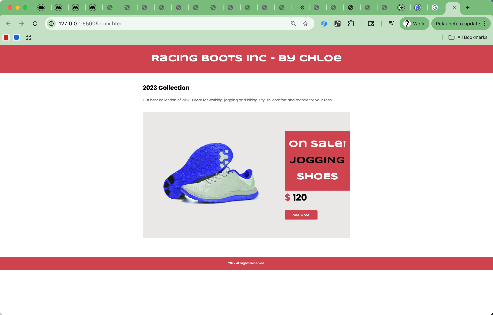

# m3-w4-d1-homework
WEB 602 Back-end

What I learn:
I learned how to convert traditional CSS into a structured LESS architecture. I practiced using LESS principles, including variables, nesting, mixins, and imports, to organize styles in a more reusable and maintainable way. I also learned how to separate my styles into multiple LESS files such as colors.less, fonts.less, and mixins.less, and then combine them inside a main racing.less file.

